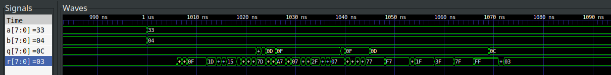

# NANDs-to-DIV8

POC that NAND gates achieves [functional completeness](https://en.wikipedia.org/wiki/Functional_completeness) and can be used to build any complex binary function. In this example, a circuit calculating 8-bits integer division is built from 1720 NANDs gates.

## Installation

You need to install **ghdl** to compile and simulate your circuits, as well as **gtkwave** to view the signals evolution over time.

On Ubuntu, you just need to install the respective packages:

```
sudo apt-get install ghdl gtkwave
```

## Compilation & run

```
bash compile.sh
```

This will compile the vhdl sources and perform benchtests (like regression tests).
You can then visualize the results with gtkwave. For instance:

```
gtkwave div8_tb.vcd
```


## Example



In this example, a = 51 (0x33) is divided by b = 4. The computation finishes after 72 ns (352 ns at worst), and the resulting quotient is q = 12 (0x0C), with a remainder of r = 3.

